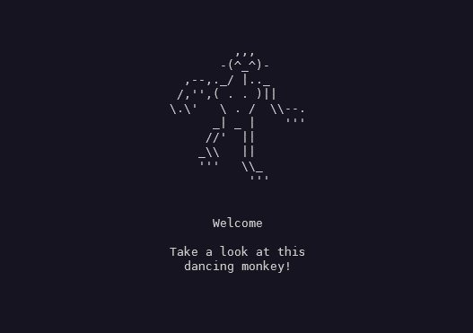

# Dancing-Monkey



A simple C++ program that displays a dancing monkey in the terminal.

## Installation

```bash
sudo make install
```

## Usage

```bash
./dancing-monkey
```

## Uninstall

```bash
sudo make uninstall
```

## License

[GNU GENERAL PUBLIC LICENSE](LICENSE)

## Author

[derDere](https://github.com/derDere)
